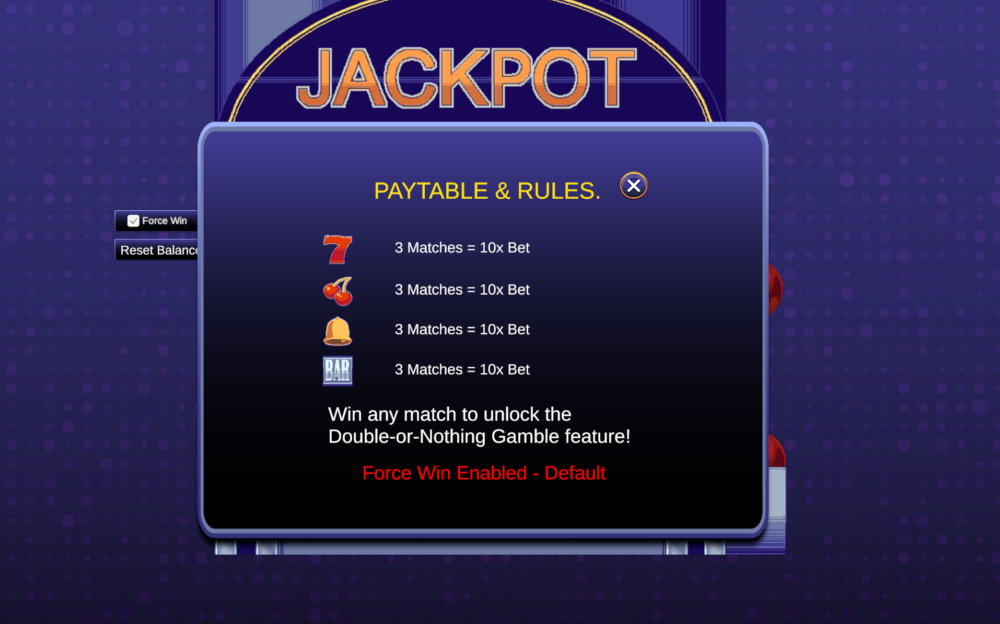
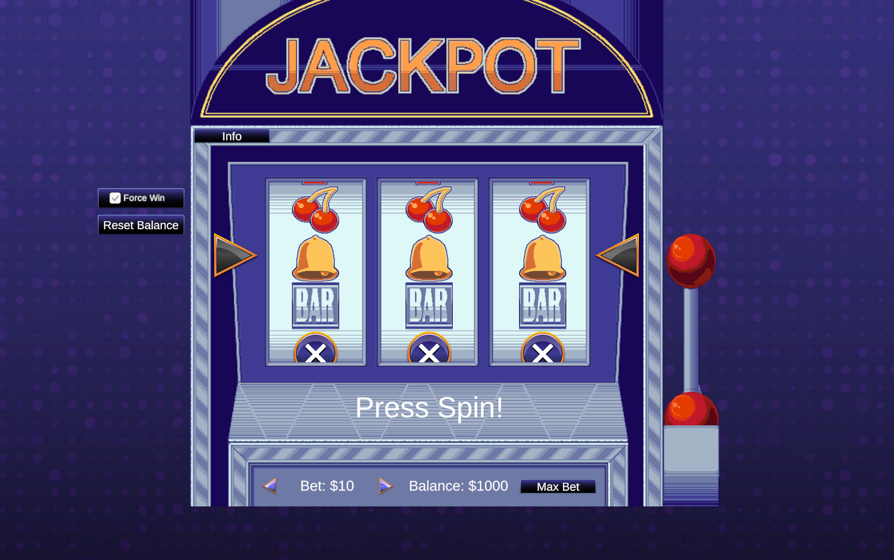

# Unity 2D Slot Machine Game
[Play the Live WebGL Demo Here!](https://roshanamancha17.github.io/Slot-Game-Assignment/Builds/WebGL/index.html)

## 🎮 Game Overview
This is a fully functional, UI-driven 2D slot machine built in Unity (Universal 2D). It demonstrates clean UI hierarchy management, programmatic animation, and structured C# logic. Players can manage a virtual balance, place custom bets, and spin the reels to match symbols for payouts.

## ✨ Core Features & Bonus Additions
In addition to the core assignment requirements (Winning Logic, RNG, Clean UI), this project includes several creative additions to enhance game feel and player engagement:
* **Dynamic Betting Economy:** Players start with a $1000 balance and can increase, decrease, or use a "Max Bet" function before spinning.
* **Double-or-Nothing Gamble Mechanic:** Landing a jackpot triggers a risk/reward popup, allowing players to flip a coin to either double their payout or lose the spin's winnings.
* **Debug / Force Win Toggle:** A built-in developer testing tool that bypasses the RNG to guarantee a random jackpot, streamlining the QA process.
* **Interactive Paytable:** A UI panel that displays symbol values and game rules, visible upon launching the game and accessible via an "Info" button.
* **Sequential Reel Stopping:** Reels lock into place one by one using C# Coroutines, mimicking the suspenseful mechanical feel of a real-world slot machine.
* **Reset Functionality:** A dedicated reset button allowing players to instantly restore their starting balance if they go bankrupt.

## 🧠 Technical Approach & Architecture
The codebase was designed with strict Object-Oriented Programming principles to ensure scalability and maintainability:

* **State Machine Architecture (`SlotController.cs`):** 
  The game logic is governed by a central state machine (`Idle`, `Spinning`, `Resolving`, `Gambling`). This prevents edge-case bugs, such as a player attempting to change their bet or click "Spin" while the reels are already in motion.
* **Programmatic Infinite Loop Animation (`Reel.cs`):** 
  Rather than relying on static Unity Animator timelines, the reel animations are entirely math-driven. UI Image arrays are translated downwards via `Time.deltaTime`. When a symbol passes a bottom threshold, it teleports to the top of the stack, creating a seamless, infinite waterfall illusion. 
* **Pre-Determined RNG Logic:** 
  To ensure absolute fairness and control, the Random Number Generator calculates the final outcome the moment the player clicks "Spin". The central controller then passes these specific sprite targets to the individual reels, commanding them to stop and snap to the pre-calculated results.

## 🚀 Instructions to Run WebGL Build
1. Clone or download this repository to your local machine.
2. Navigate to the `Build/WebGL/` directory.
3. Open the `index.html` file using any modern web browser (Chrome, Firefox, Edge, Safari). 
   * *Note: Depending on your browser's security settings regarding local file execution, you may need to host the folder on a local server (e.g., using VS Code's Live Server extension or Python's `http.server`) to run the game properly.*

## 👨‍💻 About the Developer
Developed by **Roshan Amancha**. Drawing on professional studio experience from my time at BlackHole Infiverse, I prioritize clean OOP architecture, scalable core mechanics, and highly polished UI/UX integration in all my game development projects.
